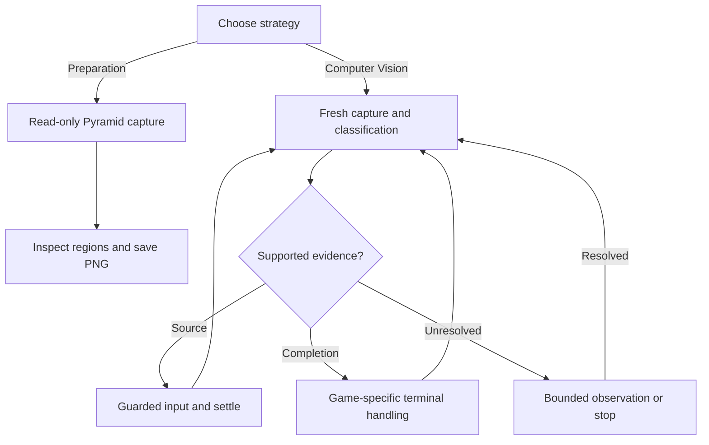

# qmp-qemu-socket

Release **v2.0.10**.

## Computer Vision solving

The implemented Computer Vision methodology follows the built-in **Solver** in Microsoft Solitaire & Casual Games. The Rust application captures a Windows 11 guest display through an existing QEMU QMP Unix socket, recognises a supported source **HALO**, and sends the corresponding guarded mouse click or keyboard operation. An egui desktop interface displays the captured frame, selected game, execution controls and diagnostic output.

The guest supplies the move recommendation; the application supplies visual recognition, input delivery and game-specific transition handling. It does not independently choose moves by reading card identities. The five games provide repeatable environments for exercising capture, image processing and remote control while developing reusable primitives for route-planning experiments.

## Shortest Path route calculation

The second methodology is intended to build an independent state model and search for a route using **Dijkstra or A***, rather than follow the guest's Solver. The longer-term goal includes evaluating move costs, deciding when to defer an available move, and replanning when new information reveals an impasse. This work is intended to inform future drone route-planning experiments; no drone controller is implemented here.

The implemented stage is **read-only Pyramid preparation**: capture a board, inspect its calibrated regions and preview or save the original PNG. Independent card recognition, a complete deal model, stock reconnaissance, Undo All reset, shortest-path search and calculated-route execution are not implemented. Choosing this strategy disables Solver, gameplay and terminal input at both the UI and worker boundaries.

## Strategy selection and execution

Choose a solving strategy before any automatic QMP connection or capture begins. **Game Type** is a separate selection for Computer Vision solving, displayed in this order: **Klondike, Spider, Free Cell, Pyramid, TriPeaks**. The initial Computer Vision game remains TriPeaks. Shortest Path preparation currently selects Pyramid only.

Strategy, game and socket changes clear prior prediction and progress authority. Requests and results carry the selected strategy, game, socket and a selection generation, preventing a late worker result from restoring an earlier selection.

| Control | Behaviour |
| --- | --- |
| Capture Frame | Obtain a fresh read-only advisory image and prediction. |
| Single Step | Request at most one gameplay action from fresh supported evidence. Solver setup, where allowed, is separate from that gameplay budget. |
| Multiple Steps | Follow fresh supported targets up to a finite budget, or use **0 = continuous** until STOP or a guarded stop. |
| Params | Change the existing socket path and bounded, game-specific timings while idle. Timing edits apply to the next run. |
| STOP | Cancel further input and interrupt cancellable waits. An in-flight QMP operation may complete or time out before the worker returns. |
| Capture PNG | Capture, inspect, label and save one original PNG without guest input. |

A HALO is source evidence, not proof that a previous move succeeded. TriPeaks and Pyramid retain their own effect, removal and redeal checks. Klondike, Free Cell and Spider follow fresh supported Solver recommendations without comparing source and recipient card pixels; their logs distinguish acknowledged actions from proven effects. Missing HALOs, an exhausted stock pile and QMP acknowledgements alone never establish a win.

An explicit TriPeaks or Pyramid run may start from a current **No HALO** preview. The worker takes one fresh capture and up to three delayed observations. If unresolved, a positively recognised nonempty board may authorise one reserved Solver setup, followed by an immediate capture and up to three more delayed observations. Only a fresh canonical target authorises gameplay. A concrete preview still has to match its fresh initial target; ordinary capture and game selection remain read-only.

The general flow is:



The diagram shows the controller's decision loop. Each game supplies its own recognition and completion rules; finite budgets, STOP and uncertain input can end the loop. Terminal restart is governed by the selected game's policy, rather than inferred from the absence of a source.

## QMP and display requirements

The application connects to an **existing local QMP Unix socket**. It does not launch QEMU or create its listener. The default filename is `qmp-qemu-socket.sock` under `XDG_RUNTIME_DIR`; use **Params** or `QMP_SOCKET_PATH` to select another existing absolute socket path. The application and QEMU must both be able to access the capture directory in their host filesystem namespaces.

The current game calibration requires the primary guest display at **1920 × 1080**, with display and text scaling at **100%**. Frames are validated against that layout; detections do not rescale coordinates or guess a different board geometry. Before guest input, the worker checks QMP health, VM running state, a current absolute pointer, STOP and the selected game/strategy context. Uncertain input delivery stops without replaying the operation.

Automatic capture is currently **file-backed**. QEMU's `screendump` writes a temporary PNG beside the socket; the worker reads its original bytes, decodes RGBA8 pixels and attempts to remove the temporary file. Detection then runs on the decoded image in memory. This is not file-free framebuffer capture, and failed cleanup or forced termination can leave a temporary PNG behind.

Decoded Computer Vision observations update the application's image control, including delayed HALO observations and post-game transitions. A bounded latest-frame slot replaces older pending images, so the UI shows the newest available observation rather than accumulating a frame queue. Display publication introduces no additional QMP screen grab and does not grant input authority.

The application uses the optional QMP, PNG, checked geometry and image-predicate facilities from **xsar v0.2.0**, pinned to Git commit `1a719b359a51d1e1e3113224193a779c76de82f8`. Game calibration, source selection, capture acquisition, completion policy and exact-byte saving remain application-owned. Ordinary Cargo commands fetch that Git dependency; a local xsar checkout or crates.io publication is not required.

## Captures and diagnostic records

**Capture PNG** obtains a separate fresh, read-only QMP screenshot. The dialog displays that capture while an optional label is entered. **Save PNG** or Enter writes the retained original PNG bytes without another screen grab; **Recapture** replaces the pending capture, and **Cancel** discards it. Preview scaling and target overlays do not alter the saved image.

`QMP_SNAPSHOT_DIR` selects the save directory. Otherwise the application uses `$HOME/Pictures/Screenshots`, then `$HOME/Pictures`, when those directories exist, and finally the system temporary directory. Saved files use a local timestamp, a bounded label and exclusive mode-0600 creation.

Private session logs use `QMP_SESSION_LOG_DIR`, otherwise `$HOME/tmp` when it exists, otherwise the system temporary directory. The `qmp-qemu-socket-*.log` files retain the full session independently of the on-screen output. The visible buffer retains at most 2000 entries and rolls over after every three completed games. **Text size** changes the visible output labels only; copied and logged text are unchanged.

When a run stops on uncertain evidence, retain its log and an original PNG of the guest state before manually advancing it. A saved image establishes its own observed state; it should not be assumed to be byte-identical to a different capture named in an earlier log.

## Build and verification

Build from the repository root on the Linux development host. `rust-toolchain.toml` selects floating **nightly** with Clippy and Rustfmt components; `Cargo.toml` declares edition 2024 and minimum Rust **1.101.0**. The channel is not a dated compiler pin, so record the actual compiler and Cargo versions used. Stable compatibility is not established by the toolchain file.

1. Validate the source and documentation.

```zsh
rustc --version &&
cargo --version &&
cargo check --locked &&
cargo test --locked -- --include-ignored &&
RUSTDOCFLAGS='-D warnings' cargo doc --locked --no-deps --document-private-items &&
cargo clippy --locked --all-targets -- -D warnings
```

The integration tests require local Unix socket creation. `--include-ignored`
runs that explicit host-test group as well as the ordinary suite; restricted
executors can run the ordinary suite but must report these tests as unverified.

2. Build the release executable in the repository's target directory.

```zsh
CARGO_TARGET_DIR="$PWD/target" cargo build --locked --release
```

3. Launch the validated release.

```zsh
./target/release/qmp-qemu-socket
```

Build and test results do not establish live guest behaviour. Verify the selected game, HALO handling, transitions, image updates and STOP against the intended guest configuration. Formatting is separate from these checks; follow the repository's documented source-spacing policy.

## Design and historical evidence

The [v2.0.10 release notes](docs/release-v2.0.10.md) describe the bounded TriPeaks terminal acquisition allowance and verification. Supporting material includes [architecture](docs/architecture.md), [QMP and capture design](docs/qmp-and-capture.md), [Pyramid execution](docs/pyramid-execution.md) and [development conventions](docs/development.md).

Earlier implementation decisions and fixture limitations remain in the [development records](docs/), including the [strategy split](docs/strategy-v2.0.0-candidate-2.md), [CLASSIC baseline and Solver startup](docs/classic-v2.0.0-candidate-7.md), [Free Cell OK layouts](docs/freecell-v2.0.0-candidate-4.md) and [capture preview publication](docs/capture-preview-v2.0.0-candidate-5.md). Those dated records retain their original scope; earlier Klondike card-effect experiments do not describe its current Solver-led execution policy.

## Klondike

Klondike uses the calibrated **Draw 1** layout. Selection priority is **DRAW/RECYCLE → RIGHT HALO → RIGHT Solve → lowest tableau source → SUIT piles**. Draw sends the confirmed `d` shortcut; recycle clicks the recognised stock control. The changing waste fan and source-run geometry are measured from each fresh frame. A supported solid source receives one click, including a run or a source from a SUIT pile; dashed destinations are not clicked. The separate **Solve** control can authorise automatic finishing when its own lettering, interior, empty-stock and scene checks pass. The lower-toolbar **Solver** remains the recommendation control.

Each acknowledged gameplay operation consumes one budget slot, followed by editable settle and a fresh capture. Ordinary missing-HALO recovery is bounded and permits at most one Solver refresh per unresolved context; unknown scenes or uncertain delivery stop. Independent positive completion evidence is required before terminal handling. Finite runs stop at the confirmed win; continuous mode follows the supported score, optional Level Up, New Game, Draw 1 Play and fresh-board stages. CLASSIC blue backs and previously measured red backs remain supported; colour alone cannot authorise input.

## Spider

Spider scans ten **PLAY** columns, the lower-right **DRAW PILE** and the display-only **COLLAPSED SUITS** area. A highlighted Draw has priority and sends `d` to deal one card to each column. Otherwise the controller selects the lowest supported solid PLAY source, with left-to-right ties, and clicks its visible bottom-card area. Connected overlapping outlines form one source; dashed destinations and collapsed suits are never clicked. Source reads and clicks remain above the calibrated toolbar cutoff. After a released PLAY click, a movement-only pointer park at `(20, 500)` clears the source area before settling and recapturing; Draw does not park.

Stock recognition retains measured red support and uses the shared CLASSIC-blue predicate, alongside the existing closed-outline, occupancy, scene and active-Solver guards. Live play across all five game types has been reported successful. Automated CLASSIC-blue Draw fixture coverage remains synthetic; an original native blue Draw fixture has not yet been supplied. The controller may activate an inactive Solver once on a supported board, but does not refresh an active Solver. Missing HALOs and an exhausted stock do not prove completion. One board is one game: finite runs stop at recognised win entry, while continuous mode follows score skip, optional OK, New Game, Spider Play and fresh-board Solver activation through bounded observations.

## Free Cell

Free Cell checks **CELL 1–4** before the lowest supported source in **PLAY 1–8**, with left-to-right ties. One solid highlighted source block receives one bottom-card click, followed by editable settling and a fresh observation. Repeated source positions are valid, and a run extending behind the toolbar is accepted only from its visible source geometry and card paper. Dashed destination guides are not sources. The **SUIT 1–4** piles are display-only for input selection; there is no Draw, Recycle or Solve operation, and no card-back recognition is needed for its face-up layout.

Automatic suit transfers can temporarily remove the HALO. An inactive Solver receives a game-start wait and fresh capture before activation; an active Solver receives one delayed input-free observation before a possible refresh. Activation and refresh share one reserve per unresolved context, and further observations remain bounded. Unknown scenes and uncertain delivery stop. One board is one game. Independent win entry precedes the score-skip, optional Level Up OK, New Game and Play sequence, which restarts only in continuous mode. Local OK recognition includes the original layout and the evidenced higher and lower positions; rank, medal and surrounding artwork do not supply button authority.

## Pyramid

Computer Vision Pyramid uses 31 calibrated targets: **Move/Recycle, Left, Right**, then the 28 tableau cards from the bottom row upward and left to right. Multiple highlights are expected; the first eligible source supplies one operation, allowing the guest Solver to remove a pair or a King. A highlighted Move/Recycle uses `d`, while pile and tableau sources use one click. Unlike the three source-only controllers, Pyramid retains positive effect and card-removal checks. Only a clicked card whose removal is verified becomes consumed; lower controls remain repeatable. A narrowly supported repeated Left/Right pair may continue from fresh HALOs without claiming the preceding effect or advancing completion.

No-HALO startup may reserve one Solver setup only after positive nonempty-board evidence. Ordinary post-action and redeal observations retain their separate bounded policies, and unknown occupancy cannot invent an available card or completed board. Confirmed redeals reset consumed-card state; the shared progress and post-game controller handles the calibrated three-board game flow. Pyramid is also the sole current **Shortest Path preparation** fixture: that strategy captures and saves without gameplay, stock surveying, Undo All input or route calculation.

## TriPeaks

TriPeaks combines calibrated lower-panel controls with tableau scans that follow exposed rows and widen when fresh card evidence requires it. A supported stock recommendation sends `d`; a supported tableau recommendation clicks its fixed card location. The controller retains cursor-excluded action-effect checks and uses fresh accepted result frames to plan subsequent operations. Explicit no-HALO startup and late-HALO recovery use bounded observation and positively gated Solver setup; neither a missing source nor an acknowledgement establishes removal or completion.

TriPeaks uses the shared calibrated three-board progress, redeal and post-game flow. The final-win transition has its own narrow recognition path: only a qualifying delivered top-row card action, the existing effect threshold, no fresh actionable target or occupied row evidence, and two consecutive frames of the same supported terminal type can establish that completion. The supported types are the Congratulations reward panel and the separately recognised Level Up panel covering that reward. Qualified final-card acquisition permits up to 30 total post-action captures; a recognised candidate receives the separate four-capture confirmation allowance. A confirmed Level Up entry goes directly to its freshly recognised OK control without a preceding centre skip. If OK reveals the reward panel, two fresh positive observations authorise its bounded skip before New Game. The guarded terminal sequence and budgets remain bounded; changing level, XP and central rank artwork are not template conditions. Unrecognised transitions stop for inspection rather than being treated as a win.
