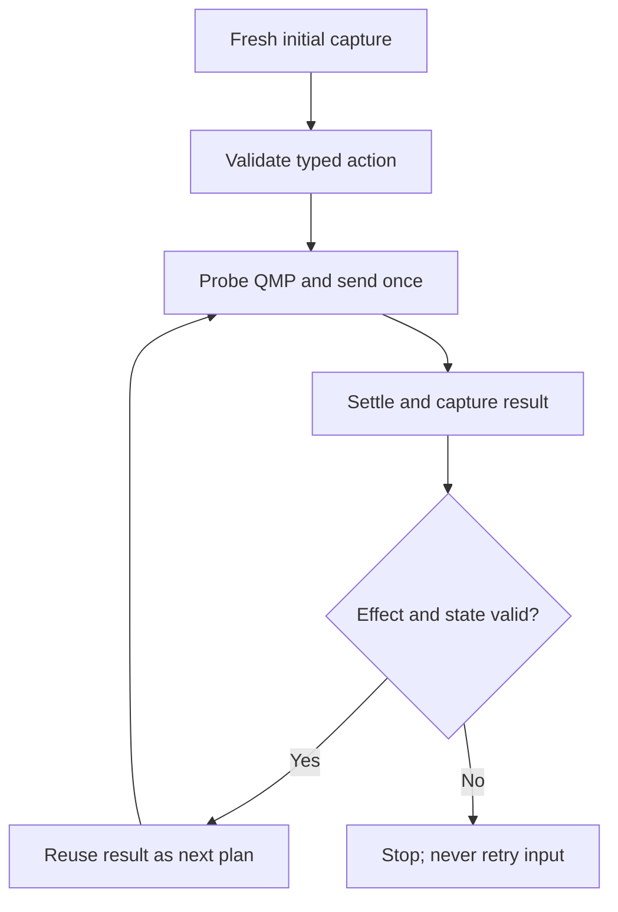

# Architecture and control flow

## Component boundaries

| Module | Responsibility |
|---|---|
| `app.rs` | egui controls, latest-frame preview, concise status and bounded visible output |
| `game.rs` | small game/profile boundary and typed actions |
| `tripeaks.rs` | validated TriPeaks profile assembly |
| `pyramid.rs` | calibration-only Pyramid targets, bounds, hit points and priority |
| `parameters.rs` | fixed geometry, colour values, delays, limits and release label |
| `capture.rs` | decoded immutable frame representation |
| `snapshot.rs` | collision-safe PNG naming and saving the original captured bytes |
| `cards.rs` | card identities and calibrated regions |
| `card_reader.rs` | bounded card-rank recognition for the calibrated display |
| `detector.rs` | bounded pixel and scene discriminators |
| `tracker.rs` | profile-driven HALO and row observation |
| `stepper.rs` | one typed action plan and result validation |
| `geometry.rs` | guest-pixel and QMP coordinate conversion |
| `qmp.rs` | allow-listed QMP client and non-idempotent input delivery |
| `worker.rs` | capture, guarded execution, recovery, timing and cancellation |

`GameMode` selects a static `GameProfile`. Shared control code does not branch
on Pyramid geometry. TriPeaks is executable; Pyramid supplies read-only
preview geometry for 28 card slots and the Left, Move and Right controls.
Pyramid's executable action lists remain empty. Shared Solver, Undo All and
Undo toolbar geometry has explicit `SHARED_*` names and is shown in both
profiles; displaying a target does not authorise input.

## Normal guarded run

The initial UI prediction is advisory. The first input requires a fresh frame
that reproduces it. Thereafter, the result frame has already been captured
after settling, checked for a material effect and classified as a valid state;
it becomes the next action's planning frame. The worker still checks STOP and
freshly probes VM/pointer state before each input.

For N ordinary actions this yields one initial capture plus N result captures.
Bounded recovery and board/game transitions may require additional sparse
observations.

## Input ownership

Only `worker.rs` owns a connected `QmpClient` in the application control flow.
Ordinary gameplay operations require a validated `StepPlan`; bounded board and
post-game transitions have separate worker paths with stage checks and retry
limits. Read-only capture, detector, UI and profile code cannot send input.

Each action has:

- stable semantic identity;
- exactly one `InputOperation`;
- an animation class and settle delay;
- an effect region and minimum changed-pixel count;
- a repeat-target policy.

A QMP error after delivery begins makes the result uncertain. The operation is
not automatically retried.

## Capture and connection lifetime

The worker owns a QMP connection for one read-only capture or snapshot request,
or for the duration of an active guarded run. A run reuses its connection
across actions, result captures and post-game transitions. It drops the client
when the request returns. STOP is cooperative: a pending request does not
interrupt an in-flight socket operation, and release handling can complete
before the worker exits.

Every capture currently follows the same file-backed path: reserve a private
temporary PNG beside the socket, ask QEMU to write it, read its bytes, decode
RGBA, and attempt file removal during normal cleanup. Detectors consume the
decoded frame. Neither the QMP socket nor `CapturedFrame` is a native-framebuffer
transport. The unused `FrameSource` trait does not provide another backend.

Manual Capture PNG additionally keeps the fresh original PNG bytes and the
decoded frame in the dialog until Save, Recapture or Cancel. Save writes the
stored bytes without another capture. Preview scaling never changes the saved
PNG. File-free automatic capture remains an open requirement; it has not been
implemented or benchmarked.

## Mode availability

| Capability | TriPeaks | Pyramid (read-only calibration) |
|---|---:|---:|
| Capture Frame | Yes | Yes |
| Track coordinates | Yes | Yes |
| Draw profile overlays | Yes | Yes, 31 calibration targets and shared toolbar |
| HALO classification | Yes | No |
| Single Step | Yes | No |
| Multiple Steps | Yes | No |
| Guest input | Yes, guarded | No, independently rejected by worker |

Pyramid's semantic order is `Move`, `Left`, `Right`, then 28 card identities
from row 7 left-to-right upward to the row-1 apex. Target bounds and hit points
are preview calibration metadata, not executable actions. HALO probes and
effect verification remain unvalidated. See `pyramid-calibration.md` for
the source images and evidence limits.

## State and bounds

- Frame size is locked to 1920x1080.
- Startup requests one read-only capture; previews are bound to the requesting
  game mode and QMP socket, then mapped to host physical pixels.
- Unknown visual progress remains `?/3` rather than being promoted from the
  session counter. Verified board completions publish the advisory counter
  immediately; full three-segment visual calibration remains pending.
- The main preview mailbox retains only the newest pending full-resolution
  frame. A manual snapshot separately retains its original PNG and decoded frame.
- The visible log is bounded; the complete private session log remains on
  disk.
- Multi-Step defaults to continuous (`0`) and is STOP-cancellable.
- Transition retries and click attempts are bounded.
- Advisory session counters never override visual transition evidence.
- STOP and application exit detach locally; neither shuts down QEMU or Windows.

## Identity and host paths

`Cargo.toml` is the application name/version source. `main.rs` launches
`QmpQemuSocketApp`; parameters, logs, screenshots and temporary capture names
use the `qmp-qemu-socket` identity. References to Microsoft Solitaire and its
Solver control identify the guest application and its UI.

`QMP_SOCKET_PATH` overrides the socket path. Otherwise `XDG_RUNTIME_DIR` takes
precedence; the fallbacks are `QMP_RUNTIME_DIR`, an existing
`$HOME/tmp/qemu-runtime`, then the system temporary directory's `qemu-runtime`
subdirectory. The filename is `qmp-qemu-socket.sock`. These directories must
already be usable; the application does not create the QEMU listener.

Use an absolute socket path. The temporary PNG path is derived from its parent
directory and must also be absolute. Consequently the normal configuration does
not depend on the working directory of QEMU or the application. Both processes
must see and have access to the same host paths; a remote or isolated QEMU
filesystem is not supported by this capture design.

## Coordinate domains

| Domain | Origin and units | Use |
|---|---|---|
| egui | top-left, logical points | Widget layout only |
| guest frame | top-left, physical pixels | ROIs, detection, tracking and preview overlays |
| QMP absolute | top-left, integer `0..=32767` per axis | Guest pointer input |

Host desktop coordinates never enter the QMP transform.
