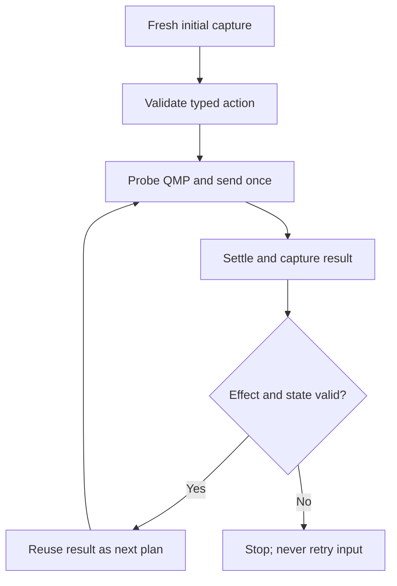

# Architecture and control flow

## Component boundaries

| Module | Responsibility |
|---|---|
| `app.rs` | egui controls, latest-frame preview, concise status and bounded visible output |
| `game.rs` | small game/profile boundary and typed actions |
| `tripeaks.rs` | validated TriPeaks profile assembly |
| `pyramid.rs` | calibration-only Pyramid identity and target priority |
| `parameters.rs` | fixed geometry, colour values, delays, limits and release label |
| `capture.rs` | decoded immutable frame representation |
| `detector.rs` | bounded pixel and scene discriminators |
| `tracker.rs` | profile-driven HALO and row observation |
| `stepper.rs` | one typed action plan and result validation |
| `geometry.rs` | guest-pixel and QMP coordinate conversion |
| `qmp.rs` | allow-listed QMP client and non-idempotent input delivery |
| `worker.rs` | capture, guarded execution, recovery, timing and cancellation |

`GameMode` selects a static `GameProfile`. Shared control code does not branch
on Pyramid geometry. TriPeaks is executable; Pyramid supplies broad read-only
preview envelopes and no action geometry.

## Normal guarded run

The initial UI prediction is advisory. The first input requires a fresh frame
that reproduces it. Thereafter, the result frame has already been captured
after settling, checked for a material effect and classified as a valid state;
it becomes the next action's planning frame. The worker still checks STOP and
freshly probes VM/pointer state before each input.

For N ordinary actions this yields one initial capture plus N result captures.
Bounded recovery and board/game transitions may require additional sparse
observations.

## Input ownership

Only `worker.rs` owns a connected `QmpClient`, and only a `StepPlan` can select
the non-idempotent gameplay operation. Read-only capture, detector, UI and
profile code cannot send input.

Each action has:

- stable semantic identity;
- exactly one `InputOperation`;
- an animation class and settle delay;
- an effect region and minimum changed-pixel count;
- a repeat-target policy.

A QMP error after delivery begins makes the result uncertain. The operation is
not automatically retried.

## Mode availability

| Capability | TriPeaks | Pyramid (read-only calibration) |
|---|---:|---:|
| Capture Frame | Yes | Yes |
| Track coordinates | Yes | Yes |
| Draw profile overlays | Yes | Yes, broad calibration envelopes |
| HALO classification | Yes | No |
| Single Step | Yes | No |
| Multiple Steps | Yes | No |
| Guest input | Yes, guarded | No, independently rejected by worker |

Pyramid's approved semantic order is `Move`, `Left`, `Right`, then 28 card
identities from row 7 left-to-right upward to the row-1 apex. Exact 2x2 HALO
probes and click coordinates remain deliberately absent.

## State and bounds

- Frame size is locked to 1920x1080.
- Startup requests one read-only capture; previews are bound to the requesting
  game mode and QMP socket, then mapped to host physical pixels.
- Unknown visual progress remains `?/3` rather than being promoted from the
  session counter. Verified board completions publish the advisory counter
  immediately; full three-segment visual calibration remains pending.
- The preview retains only the newest pending full-resolution frame.
- The visible log is bounded; the complete private session log remains on
  disk.
- Multi-Step defaults to continuous (`0`) and is STOP-cancellable.
- Transition retries and click attempts are bounded.
- Advisory session counters never override visual transition evidence.
- STOP and application exit detach locally; neither shuts down QEMU or Windows.

## Coordinate domains

| Domain | Origin and units | Use |
|---|---|---|
| egui | top-left, logical points | Widget layout only |
| guest frame | top-left, physical pixels | ROIs, detection, tracking and preview overlays |
| QMP absolute | top-left, integer `0..=32767` per axis | Guest pointer input |

Host desktop coordinates never enter the QMP transform.
