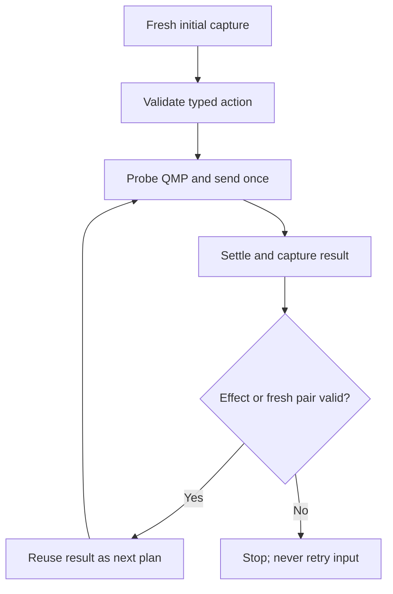

# Architecture and control flow

## Component boundaries

| **Module** | **Responsibility** |
| --- | --- |
| `app.rs` | egui controls, latest-frame preview, concise status and bounded visible output |
| `session_log.rs` | private session-file creation, append and complete-history reads |
| `game.rs` | small game/profile boundary and typed actions |
| `tripeaks.rs` | validated TriPeaks profile assembly |
| `klondike.rs` | Klondike dynamic source blocks, stock/recycle, RIGHT fan, Solve control and effect evidence |
| `klondike_terminal.rs` | Klondike completed-game scenes, terminal controls and fresh Draw 1 deal recognition |
| `pyramid.rs` | Pyramid targets, fixed halo probes, priority and action-effect evidence |
| `parameters.rs` | fixed geometry, colour values, delays, limits and release label |
| `capture.rs` | decoded immutable frame representation |
| `snapshot.rs` | collision-safe PNG naming and saving the original captured bytes |
| `cards.rs` | calibrated card regions and test-only geometry validation |
| `detector.rs` | bounded pixel and scene discriminators |
| `tracker.rs` | profile-driven HALO and row observation |
| `stepper.rs` | one typed action plan and result validation |
| `geometry.rs` | guest-pixel and QMP coordinate conversion |
| `qmp.rs` | allow-listed QMP client and non-idempotent input delivery |
| `worker.rs` | worker commands/events, capture, guarded execution, timing and cancellation |
| `worker/post_game.rs` | shared score, Level Up, New Game, Play and Solver progression |
| `worker/pyramid_execution.rs` | Pyramid effect, fresh-pair continuation and redeal checks |
| `worker/klondike_execution.rs` | Klondike execution, bounded recovery, independent completion and continuous terminal progression |
| `worker/tests.rs` | worker regression cases, including transition and cancellation guards |

---

`GameMode` selects a static `GameProfile`. TriPeaks and Pyramid share the QMP
controller, Solver toolbar control, cancellation and guarded post-game stages.
Their target detection and effect rules remain separate: TriPeaks requires one
unique highlight; Pyramid chooses the first eligible target in its ordered
31-slot profile. Typed action identities must belong to the selected mode.
Shared Solver, Undo All and Undo toolbar geometry has explicit `SHARED_*`
names. Displaying an overlay alone never grants input authority.

## Normal guarded run

```mermaid
flowchart TD
    A["Fresh initial capture"] --> B["Validate typed action"]
    B --> C["Probe QMP and send once"]
    C --> D["Settle and capture result"]
    D --> E{"Effect or fresh pair valid?"}
    E -->|"Yes"| F["Reuse result as next plan"]
    E -->|"No"| G["Stop; never retry input"]
    F --> C
```

The initial UI prediction is advisory. The first input requires a fresh frame
that reproduces it. Thereafter, the result frame has already been captured
after settling and accepted through the selected game's result policy. An
effect-verified state, Pyramid's strictly qualified repeated Left/Right HALO
pair, or Klondike's source-supported fresh recommendation becomes the next
action's planning frame. Fresh-HALO continuation is
recorded separately and does not claim the previous effect was proven. The
worker still checks STOP and
freshly probes VM/pointer state before each input.

For N ordinary actions this yields one initial capture plus N result captures.
Bounded recovery and board/game transitions may require additional sparse
observations.

## Input ownership

Only the worker module owns a connected `QmpClient` in the application control flow.
Its post-game and Pyramid execution submodules borrow that connection.
Ordinary gameplay operations require a validated `StepPlan`; bounded board and
post-game transitions have separate worker paths with stage checks and retry
limits. Read-only capture, detector, UI and profile code cannot send input.

Each action has:

- stable semantic identity;
- exactly one `InputOperation`;
- an animation class and settle delay;
- an effect region and minimum changed-pixel count;
- a repeat-target policy.

A QMP error after delivery begins makes the result uncertain. The operation is
not automatically retried.

## Capture and connection lifetime

The worker owns a QMP connection for one read-only capture or snapshot request,
or for the duration of an active guarded run. A run reuses its connection
across actions, result captures and post-game transitions. It drops the client
when the request returns. STOP is cooperative: a pending request does not
interrupt an in-flight socket operation, and release handling can complete
before the worker exits.

Every capture currently follows the same file-backed path: reserve a private
temporary PNG beside the socket, ask QEMU to write it, read its bytes, decode
RGBA, and attempt file removal during normal cleanup. Detectors consume the
decoded frame. Neither the QMP socket nor `CapturedFrame` is a native-framebuffer
transport. The unused `FrameSource` abstraction and file-reading wrapper were
removed for 1.1.0; no replacement capture backend was introduced.

Manual Capture PNG additionally keeps the fresh original PNG bytes and the
decoded frame in the dialog until Save, Recapture or Cancel. Save writes the
stored bytes without another capture. Preview scaling never changes the saved
PNG. File-free automatic capture remains an open requirement; it has not been
implemented or benchmarked.

## Mode availability

| **Capability** | **TriPeaks** | **Pyramid** |
| --- | --- | --- |
| Capture Frame / Capture PNG | Read-only | Read-only |
| Track coordinates / Draw Targets | Preview only | Preview only |
| HALO selection | Unique across frame | First eligible of 31 fixed 2×2 probes |
| Single Step / Multiple Steps | Guarded | Guarded |
| Ordinary input | Draw key or tableau click | One mouse click |
| Settling | Configurable draw/tableau delays | Configurable Move/card/reobserve; defaults 1000/2000/1000 ms |
| Board/game transitions | Shared guarded controller | Shared guarded controller |

Pyramid's semantic order is `Move`, `Left`, `Right`, then 28 card identities
from row 7 left-to-right upward to the row-1 apex. It does not use TriPeaks row
exposure or unique-target policy. A highlighted pair needs one click; no
second click is queued.

Pyramid keeps `clicked_target_slots[31]` for the current board. Only a clicked
`Card` receives a consumed mark, and only after its face is positively observed
as removed. A highlight disappearing or arbitrary changed pixels are
insufficient. The unclicked partner receives no consumed mark. `Move`, `Left`
and `Right` are always eligible for later scans, including consecutive actions,
when their effect has been verified. A settled fresh Left/Right pair can also
authorise continuation when its two replacement cards look identical; that
route neither retires a card nor advances completion counters.

Unsettled effects receive a bounded number of fresh observations, spaced by
the snapshotted Pyramid repeat delay (default 1000 ms), without resending the gameplay click. A halo-free ordinary result
is recaptured without Solver input. Only positively confirmed redeal
evidence followed by three settled halo-free new-board observations permits one Solver
re-activation on the new board. Fresh-pair continuation requires recognised
gameplay, known faces, a unique eligible Left/Right pair, remaining tableau and
no pending final-card/redeal phase. A halo alone never proves board/game
completion; an unresolved scene stops the run.

Redeal needs two consecutive gameplay captures containing restored cards and
`AnotherBoard` progress. Contradictory progress readings are logged with probe
counts and retried within the existing observation bound; no guest input is
sent while final-apex completion is pending. An early action effect does not
suppress later redeal recognition.

Confirmed redeal/new-game, an explicit progress reset, and changes of mode or
socket clear the Pyramid board state. Every new context requires a fresh scene
before guest input. See `pyramid-execution.md` for geometry and the remaining
live acceptance checks.

After a stopped run, read-only Capture Frame can encounter a new board while
the old board's consumed marks remain. Only when the fresh frame has a halo and
present card at a previously verified removed slot, and old-state analysis
found no eligible target, the worker clears the per-board record, resets the
advisory board count to unknown, and reuses that exact frame for planning. This
does not substitute for the automatic redeal checks described above.

The expanded detailed-output area has a fixed logical height. The preview
reserves that fixed space only while the log is expanded, so additional window
height increases the image area instead of stretching the log.

## Klondike boundary

Klondike uses an independent controller and no three-board progress probe.
Its dynamic target identity includes the highlighted source geometry. It follows
DRAW/RECYCLE, RIGHT HALO, RIGHT Solve, tableau bottom-up and SUIT priority, using a key for ordinary draw
and a single source click for transfers/recycle. Solid-source validation rejects
the dark dashed landing guide. Source blocks can change height after every move.
The outline search includes the evidenced overlap with the toolbar. Interior
crossbars cannot close a source while its exterior rails continue below.
Input and material-effect bounds remain above the toolbar even when the visual
source outline extends into it. The measured deeper run closes at rows988–990;
the lower-edge check excludes only Undo All's observed x1308..1336,y988..991
overlap, requiring all remaining edge pixels and the existing complete-outline
guards. Face evidence is sampled above row 947.

Tableau effect verification accepts white card paper changing to the measured
green felt dimmed beneath a destination guide. That removal evidence is counted
separately from bright replacement pixels and still requires material change at
an independent destination. Neutral grey, opaque black and a fresh source HALO
alone do not establish removal. Same-column automatic reveal also receives a
bounded source-face replacement comparison, still requiring independent
destination change. Upper SUIT returns use the corresponding fixed card-corner
replacement proof or bidirectional printed-detail changes over stable bright
paper, still with independent material source and destination bounds. A dimmed
occupied foundation can prove a small red printed-content transition while its
guide and surrounding neutral paper remain stable; this is an alternative to
the unchanged ordinary destination threshold. These checks compare pixels without
recognising card ranks or suits.

Klondike supports finite gameplay limits and zero for continuous operation.
Every unresolved action has a bounded recovery allowance. One recognised no-HALO context can request
one Solver activation and an immediate capture, followed by bounded delayed
observations. A recovery never proves the preceding gameplay effect. Unknown
scenes and uncertain input stop. An unresolved ordinary card effect may continue
only from an independently supported fresh recommendation: source-removal or
replacement proof is required for a HALO target; a recognised next Solve control
has its own authority. The route is disabled after Solver refresh and excludes
Draw/recycle. Acknowledged actions consume finite budget slots, with strict
verification and continuation counters kept separate. It does not infer previous
effect or completion. Other unresolved results stop. The independently recognised
Solve button in RIGHT's place permits one auto-finish request followed by its
separate animation delay and up to 20 delayed read-only completion observations
at the editable Klondike re-observation interval. This reuses the existing
post-game bound; ordinary card recovery retains three delayed observations. No Solve
or uncertain gameplay input is retried. An initial changed preview returns a
fresh approved prediction for review without guest input; an exact approved
no-HALO match permits one independently guarded Solver activation. An unbounded
request continues from its fresh recovered target; finite requests publish it for
review. Uncertain input is never replayed.

One Klondike board is one game. Two consecutive fresh frames must show either
an intact active Solver banner with all 76 calibrated right-interior pixels gold
and zero black, or positively recognised completed-game artwork. Overlay or
ordinary background black absence is insufficient. Finite runs stop before
terminal input. Continuous runs alone may advance through the mode-owned
score-skip, Level Up OK, New Game, Draw 1 Play and fresh-board Solver sequence.
Each recognised control is clicked once, settled and freshly observed; missing
or unchanged stages receive bounded input-free recaptures. Unexpected recognised
stages stop. Only a fresh actionable new Solver board publishes
`KlondikeGameCompleted` and resumes gameplay. Shared three-board policies remain
separate. See `klondike-v1.2.3-candidate-5.md` for evidence and limitations.

A complete 180..190-pixel single-card outline with its normal lower proof corner
crossing the toolbar can use a
separate source proof with two full 28-by-44 visible patches. The normal upper
corner stays at source-top+5; the lower-right patch is anchored at proof-bottom−44.
Both stay above row 947 and require 50% white paper and at least 48 changes in each
print direction. The route additionally requires 512 material source changes.
It supplies source replacement for acknowledged, settled, supported fresh-HALO
continuation only; it does not enter complete-effect verification. The ordinary
clipped-corner refusal and existing complete-effect policy remain unchanged.
Stack expansion is handled by the observed pixel transition; no rank or suit is
decoded. In K39/K40 the generic destination count 1298 comes from the next HALO's
shading; the actual receiving foundation changes only 318 pixels. Neither is
promoted to complete-effect proof by this new route.

## State and bounds

- Frame size is locked to 1920x1080.
- Startup requests one read-only capture; previews are bound to the requesting
  game mode and QMP socket, then mapped to host physical pixels.
- Unknown visual progress remains `?/3` rather than being promoted from the
  session counter. Verified board completions publish the advisory counter
  immediately; full three-segment visual calibration remains pending.
- The main preview mailbox retains only the newest pending full-resolution
  frame. On an unverified post-action stop, the latest result frame is shown
  for inspection without an approved prediction; a fresh Capture Frame is
  required before another guarded action. A manual snapshot separately
  retains its original PNG and decoded frame.
- The visible log is bounded; the complete private session log remains on
  disk.
- TriPeaks/Pyramid Multi-Step defaults to continuous (`0`) and is STOP-cancellable.
- Klondike Multi-Step defaults to 0; 1–10000 bounds actions and 0 runs continuously.
- Klondike Solve sends one request, then bounded read-only completion observations;
  terminal progression requires continuous authority and independent win proof.
- Transition retries and click attempts are bounded.
- Advisory session counters never override visual transition evidence.
- STOP and application exit detach locally; neither shuts down QEMU or Windows.

## Identity and host paths

`Cargo.toml` is the application name/version source. `main.rs` launches
`QmpQemuSocketApp`; parameters, logs, screenshots and temporary capture names
use the `qmp-qemu-socket` identity. References to Microsoft Solitaire and its
Solver control identify the guest application and its UI.

`QMP_SOCKET_PATH` overrides the socket path. Otherwise `XDG_RUNTIME_DIR` takes
precedence; the fallbacks are `QMP_RUNTIME_DIR`, an existing
`$HOME/tmp/qemu-runtime`, then the system temporary directory's `qemu-runtime`
subdirectory. The filename is `qmp-qemu-socket.sock`. These directories must
already be usable; the application does not create the QEMU listener.

Use an absolute socket path. The temporary PNG path is derived from its parent
directory and must also be absolute. Consequently the normal configuration does
not depend on the working directory of QEMU or the application. Both processes
must see and have access to the same host paths; a remote or isolated QEMU
filesystem is not supported by this capture design.

## Coordinate domains

| **Domain** | **Origin and units** | **Use** |
| --- | --- | --- |
| egui | top-left, logical points | Widget layout only |
| guest frame | top-left, physical pixels | ROIs, detection, tracking and preview overlays |
| QMP absolute | top-left, integer `0..=32767` per axis | Guest pointer input |

Host desktop coordinates never enter the QMP transform.

Candidate2 keeps unsupported post-action recapture inside Klondike's existing
shared result-observation budget. It retains the original action frame and plan,
skips effect/input analysis on unsupported scenes, and evaluates only fresh
supported results. Source-supported continuation does not upgrade the preceding
move to verified. Solve diagnostic counts have no input or completion authority.

## v1.2.5 correction boundary

The Solve recogniser retains empty-stock, stable interior, complete glyph and
scene/priority guards. Animated outer-ring template agreement is diagnostic only.
A bottom single-card source with uneven print changes can support continuation
only through the bounded stable-paper and bidirectional-print checks; strict
complete-effect verification is unchanged. This does not decode ranks or suits.
Level Up label variants match an entire coherent signature at the evidenced
nominal or two-pixel horizontal offset, never a mixture of individual probes.
Terminal evidence logs identify named guard failures on the same fresh frame.
All input, effect-proof and completion authorities remain separate.
